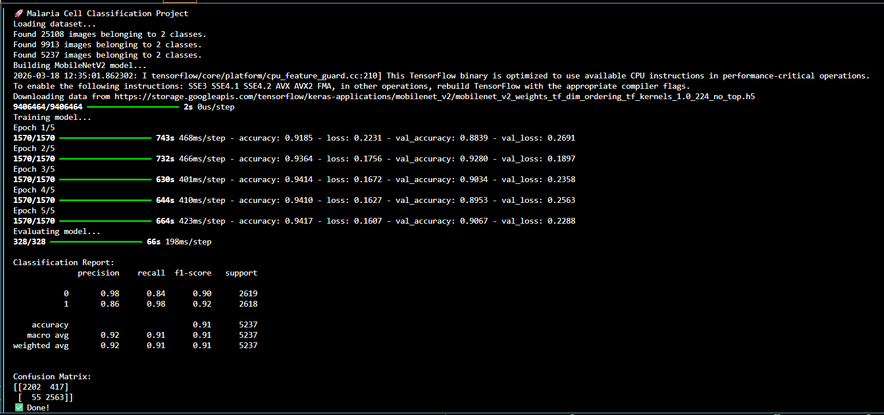

# 🧬 Malaria Cell Image Classification using CNNs

## 📌 Overview

This project uses deep learning to classify blood smear images as **Parasitized** or **Uninfected**.

It leverages transfer learning with MobileNetV2 to build an efficient and accurate medical image classification model.

---

## 🎯 Objectives

* Detect malaria-infected cells from microscopy images
* Build a complete machine learning pipeline
* Apply transfer learning for improved performance
* Evaluate model performance using standard metrics

---

## 🧠 Model

* **MobileNetV2 (Transfer Learning)**
* Pretrained on ImageNet
* Fine-tuned for binary classification

---

## 📊 Results

* **Accuracy:** ~91%
* **F1-score:** ~0.91



### Confusion Matrix

```
[[2202  417]
 [  55 2563]]
```

---

## ⚙️ Tech Stack

* Python
* TensorFlow / Keras
* NumPy
* Scikit-learn
* Matplotlib

---

## 📁 Dataset

NIH Malaria Dataset:
https://www.kaggle.com/datasets/iarunava/cell-images-for-detecting-malaria

⚠️ Dataset is not included in this repository due to size.

---

## 🚀 How to Run

1. Install dependencies:

```
pip install -r requirements.txt
```

2. Run the project:

```
python main.py
```

---

## 📂 Project Structure

```
malaria-cnn-classification/
│
├── main.py
├── split_data.py
├── requirements.txt
├── README.md
├── .gitignore
└── data/
```

---

## 💡 Future Improvements

* Add ResNet50 model for comparison
* Improve accuracy with hyperparameter tuning
* Deploy model using Streamlit or Flask
* Add image prediction interface

---

## 👤 Author

GitHub: https://github.com/jessysutherns